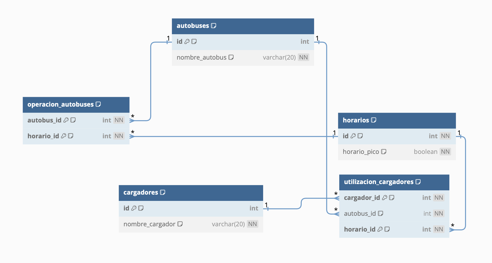

# Proyecto 3 - Gestión de Programación de Transporte Público Eléctrico
Tópicos Avanzados en Bases de Datos
Universidad Pontificia Bolivariana

## Integrantes
### 👩🏻‍💻 Luisa Maria Flórez Múnera https://github.com/luisaflorezm 👩🏻‍💻 
### 🧑🏻‍💻 Samuel Pérez Hurtado https://github.com/samuelperezh 🧑🏻‍💻

## Dominio de problema
La Secretaría de Movilidad del Municipio de Medellín en conjunto con la Empresa de Transporte Masivo
del Valle de Aburrá están realizando un estudio sobre la programación de la utilización y mantenimiento
de los buses eléctricos de tal manera que se pueda realizar una sustitución progresiva cumpliendo los
requerimientos mínimos de operación del servicio.

## Diagrama relacional

## Instructivo de compilación y ejecución de la solución del proyecto
### API
#### [ProgramacionTP_CS_API_PostgreSQL_Dapper](https://github.com/samuelperezh/tadb_202320_ex03/tree/main/ProgramacionTP_CS_API_PostgreSQL_Dapper/ProgramacionTP_CS_API_PostgreSQL_Dapper)
- WebAPI en C# con framework .NET 7.x implementando **Patrón Repositorio** con capa de persistencia de datos en PostgreSQL a través de Dapper como ORM, utilizando lógica almacenada para realizar operaciones CRUD.

Para la ejecución, se debe usar un software que permita realizar las peticiones GET, POST, PUT y DEL de la API. En este caso, se usó Postman para este propósito.

Se hizo la creación de 26 endpoints que se muestran a continuación:

1. **Obtener cargadores registrados:** Para obtener todos los cargadores se hace una petición GET en la dirección https://localhost:7024/api/Cargadores

2. **Obtener un cargador por Id:** Para obtener un cargador en específico se hace una peticion GET en la dirección https://localhost:7024/api/Cargadores/{cargador_id} donde {cargador_id} es el id del cargador a obtener.

3. **Crear un nuevo cargador:** Para crear un cargador se hace una petición POST en la dirección https://localhost:7024/api/Cargadores con un cuerpo JSON que incluye el id y el nombre del cargador.

4. **Actualizar un cargador existente:** Para actualizar un cargador se hace una petición PUT en la dirección https://localhost:7024/api/Cargadores/{cargador_id} donde {cargador_id} es el id del cargador a obtener y con un cuerpo JSON que incluye el id y el nombre del cargador.

5. **Eliminar un cargador existente:** Para eliminar un cargador se hace una petición DEL en la dirección https://localhost:7024/api/Cargadores/{cargador_id} donde {cargador_id} es el id del cargador a obtener.

6. **Obtener autobuses registrados:** Para obtener todos los autobuses registrados, realiza una petición GET a la siguiente dirección: https://localhost:7024/api/Autobuses

7. **Obtener un autobús por Id:** Para obtener un autobús específico por su Id, realiza una petición GET a la siguiente dirección: https://localhost:7024/api/Autobuses/{autobus_id} donde {autobus_id} es el id del autobús que se desea obtener.

8. **Crear un nuevo autobús:** Para crear un nuevo autobús, envía una petición POST a la siguiente dirección: https://localhost:7024/api/Autobuses. El cuerpo de la petición debe ser un objeto JSON que incluye el id y el nombre del autobús.

9. **Actualizar un autobús existente:** Para actualizar un autobús existente, envía una petición PUT a la siguiente dirección: https://localhost:7024/api/Autobuses/{autobus_id}, donde {autobus_id} es el id del autobús que se desea actualizar. El cuerpo de la petición debe contener el id y el nombre del autobús.

10. **Eliminar un autobús existente:** Para eliminar un autobús existente, envía una petición DELETE a la siguiente dirección: https://localhost:7024/api/Autobuses/{autobus_id} donde {autobus_id} es el id del autobús que deseas eliminar.

11. **Registrar utilización de cargador por hora del día:** Para registrar la utilización de un cargador en un momento específico del día, realiza una petición POST a la siguiente dirección: https://localhost:7024/api/UtilizacionCargadores. El cuerpo de la petición debe incluir detalles como el id del cargador, la hora del día y el autobus.

12. **Actualizar utilización de cargador por hora del día:** Para actualizar la información de la utilización de un cargador, se envía una petición PUT a la siguiente dirección: https://localhost:7024/api/UtilizacionCargadores/{cargador_id}/{autobus_id}/{horario_id} donde {cargador_id}, {autobus_id}, y {horario_id} son los IDs correspondientes. El cuerpo de la petición debe contener así mismo los IDs.

13. **Eliminar utilización de cargador por hora del día:** Para eliminar la información de la utilización de un cargador, se envía una petición DEL a la siguiente dirección: https://localhost:7024/api/UtilizacionCargadores/{cargador_id}/{autobus_id}/{horario_id} donde {cargador_id}, {autobus_id}, y {horario_id} son los IDs correspondientes. El cuerpo de la petición debe contener así mismo los IDs.

14. **Registrar operación por hora del día:** Para registrar la operación de un autobus en un momento específico del día, realiza una petición POST a la siguiente dirección: https://localhost:7024/api/OperacionAutobuses. El cuerpo de la petición debe incluir detalles como el id del autobus y la hora del día.

15. **Actualizar operación por hora del día:** Para actualizar la información de la operación de un autobus, se envía una petición PUT a la siguiente dirección: https://localhost:7024/api/OperacionAutobuses/{autobus_id}/{horario_id} donde donde {autobus_id}, y {horario_id} son los IDs correspondientes. El cuerpo de la petición debe contener así mismo los IDs.

16. **Eliminar operación por hora del día:** Para eliminar la información de la operación de un autobus, se envía una petición DEL a la siguiente dirección: https://localhost:7024/api/OperacionAutobuses/{autobus_id}/{horario_id} donde donde {autobus_id}, y {horario_id} son los IDs correspondientes. El cuerpo de la petición debe contener así mismo los IDs.

17. **Obtener horas registradas:** Para obtener las horas registradas, se envía una petición GET a la dirección: https://localhost:7024/api/Horarios

18. **Obtener informe de hora por Id:** Para obtener el informe de hora por id, se envía una petición GET a la dirección https://localhost:7024/api/InformeHora/{hora} donde {hora} es el parámetro de la hora que se desea obtener el informe.

19. **Obtener informe de utilización de cargadores por hora:** Para obtener el informe de utilización de cargadores por hora, se envía una petición GET a la dirección https://localhost:7024/api/InformeUtilizacionCargadores/{hora} donde {hora} es el parámetro de la hora que se desea obtener el informe.

20. **Obtener informe de utilización de buses por hora:** Para obtener el informe de utilización de buses por hora, se envía una petición GET a la dirección https://localhost:7024/api/InformeOperacionAutobuses/{hora} donde {hora} es el parámetro de la hora que se desea obtener el informe.

### Endpoints adicionales:

21. **Obtener todas las utilizaciones de cargadores:** Para obtener todas las utilizaciones de cargadores, se debe hacer una petición GET a la dirección https://localhost:7024/api/UtilizacionCargadores

22. **Obtener todas las operaciones de los autobuses:** Para obtener todas las operaciones de los autobuses, se debe hacer una petición GET a la dirección https://localhost:7024/api/OperacionAutobuses

23. **Obtener una hora registrada en específico:** Para obtener una hora registrada, se envía una petición GET a la dirección https://localhost:7024/api/Horarios/{horario_id} donde {horario_id} es el parámetro de la hora que se desea obtener.

24. **Obtener todos los informe de las horas** Para obtener el informe todas las horas, se envía una petición GET a la dirección https://localhost:7024/api/InformeHora

25. **Obtener informe de utilización de cargadores por hora:** Para obtener el informe de todas las utilizaciones de cargadores por hora, se envía una petición GET a la dirección https://localhost:7024/api/InformeUtilizacionCargadores

26. **Obtener informe de utilización de buses por hora:** Para obtener el informe de todas las operaciones de buses por hora, se envía una petición GET a la dirección https://localhost:7024/api/InformeOperacionAutobuses

